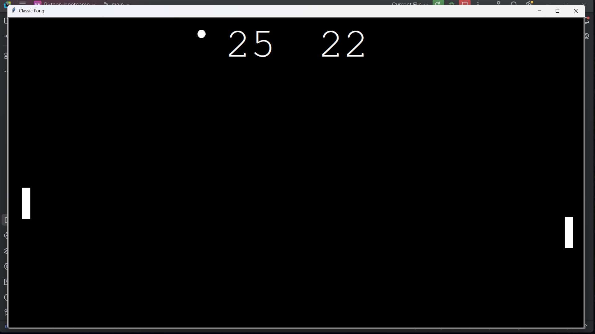

# 🏓 Classic Pong Game

Welcome to the **Classic Pong Game**, built with Python's `turtle` module! Enjoy this timeless arcade classic where you control paddles to bounce the ball and score points against your opponent.

---

## 🌟 Features
- **Classic Pong Gameplay**: Play the iconic game with easy paddle control and score tracking.
- **Responsive Controls**: Use simple keys to move paddles and challenge yourself to keep the ball in play!
- **Minimalistic Setup**: No extra dependencies—just Python.

---

## 🕹️ How to Play

1. Clone the repository:
```bash
   git clone https://github.com/Aprxmeya/pong-game.git
   cd pong-game
```
2. Run the game:
```bash
  python pong_game.py
```
3. Control the paddles using the following keys:
Up Arrow: Move the right paddle up
Down Arrow: Move the right paddle down
W: Move the left paddle up
S: Move the left paddle down

4. 🎯 The goal is to bounce the ball back and forth, scoring points each time the opponent misses.

##📸 Screenshot


##⚙️ Requirements
Python 3.8 or higher
No additional libraries are required. Just download, run, and enjoy! 🎉


Have fun and enjoy the game! 🏓
